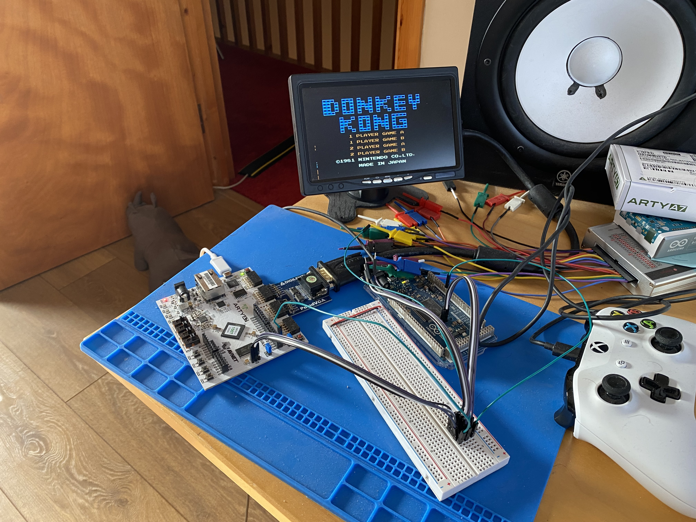

# verilog-nes

## **< WORK IN PROGRESS >**

Building a [Nintendo Entertainment System](https://en.wikipedia.org/wiki/Nintendo_Entertainment_System) in Verilog.

Aim: to play the original NES [Super Mario Bros](https://en.wikipedia.org/wiki/Super_Mario_Bros.) ROM.


## Current Status

- Implemented
   - 6502 CPU working and passing tests (for official opcodes)
   - OAM DMA working
   - PPU background layer
- Emulation
   - Verilator emulation running in C++ with [PixelGameEngine](https://github.com/OneLoneCoder/olcPixelGameEngine) renderer from [OneLoneCoder](https://www.onelonecoder.com)
   - Super Mario Bros - now able to reach splash screen
- FPGA
   - NES Running on ARTY A7 hardware
   - Arduino based interface for uploading ROMs and debugging the NES design
   - Super Mario Bros - now able to reach splash screen


| | | |
|-|-|-|
|  |   | |


# Dependencies
- Bazel v5.0.0
```bash
  brew install bazel
```
- MacOS

# C++ Debugging Bazel builds on MacOS

- Add '--spawn_strategy=local' and '--config debug' to bazel command line, to make sure symbols are correctly included in your build
   - When debugging in VSCode with a C++ config, you can see symbol values
   - Breakpoints can be set in source files via VSCode
   - When lldb stops execution at a breakpoint, VSCode is not currently able to load the correct source file - further investigation required

# 6502 cpu

## Build Unit Tests
> bazel build //nes:test-cpu6502 --incompatible_require_linker_input_cc_api=false

## Run Unit Tests
> ./bazel-bin/nes/test-cpu6502

# NES PPU (Picture Processing Unit)

## Build Unit Tests
> bazel build //nes:test-ppu --incompatible_require_linker_input_cc_api=false

## Run Unit Tests
> ./bazel-bin/nes/test-ppu

# NES CPU + PPU

## Build Unit Tests
> bazel build //nes:test-nes --incompatible_require_linker_input_cc_api=false

## Run Unit Tests
> ./bazel-bin/nes/test-nes

# VGA Output Emulator

Currently supported on MacOSX.

Implemented with the [OneLoneCoder Pixel Game Engine](https://github.com/OneLoneCoder/olcPixelGameEngine).

Test the VGA output module.

## Build 
> bazel build //nes:emulator-vga --incompatible_require_linker_input_cc_api=false --config release

## Run
> ./bazel-bin/nes/emulator-vga

# 6502 Emulator

Currently supported on MacOSX.

Implemented with the [OneLoneCoder Pixel Game Engine](https://github.com/OneLoneCoder/olcPixelGameEngine).

## Build 
> bazel build //nes:emulator-cpu --incompatible_require_linker_input_cc_api=false --config release

## Run
> ./bazel-bin/nes/emulator-cpu

## Keyboard Controls

| Key           | Action        |
| ------------: | ------------- |
| Z             | Reset Simulation |
| R             | Switch between single step and run mode    |
| SPACE         | Step through a single Opcode (in single step mode)      |

# NES Emulator

Currently supported on MacOSX.

Implemented with the [OneLoneCoder Pixel Game Engine](https://github.com/OneLoneCoder/olcPixelGameEngine).

## Build 
> bazel build //nes:emulator-nes --incompatible_require_linker_input_cc_api=false --config release

## Run
> ./bazel-bin/nes/emulator-nes

# Debugger CPU

Debugger interface for interacting with CPU6502, intended for use with SPI comms.

## Build 
> bazel build //nes:test-debugger-cpu --incompatible_require_linker_input_cc_api=false

## Run
> ./bazel-bin/nes/test-debugger-cpu

# Debugger NES

Debugger interface for interacting with NES, intended for use with SPI comms.

## Build 
> bazel build //nes:test-debugger-nes --incompatible_require_linker_input_cc_api=false

## Run
> ./bazel-bin/nes/test-debugger-nes

# Games

Information from .nes rom headers dumped with scripts/parse_ines.py

- Super Mario World
```
PRG ROM 2 x 16 KB units
CHR ROM 1 x 8 KB units
mirroring:  horizontal
has batter backed prg rom:  False
has trainer:  False
ignore mirroring control:  False
mapper number:  0
```
- Super Mario World 2
```
PRG ROM 8 x 16 KB units
CHR ROM 16 x 8 KB units
mirroring:  vertical
has batter backed prg rom:  False
has trainer:  False
ignore mirroring control:  False
mapper number:  4
```

- Super Mario World 3
```
PRG ROM 16 x 16 KB units
CHR ROM 16 x 8 KB units
mirroring:  vertical
has batter backed prg rom:  False
has trainer:  False
ignore mirroring control:  False
mapper number:  4
```
- Kirby's Adventure
'''
PRG ROM 32 x 16 KB units
CHR ROM 32 x 8 KB units
mirroring:  vertical
has batter backed prg rom:  True
has trainer:  False
ignore mirroring control:  False
mapper number:  4
'''

# Mappers

- Mapper number: 0 = [NROM](https://wiki.nesdev.com/w/index.php/NROM)
- Mapper number: 4 = [MMC3](https://wiki.nesdev.com/w/index.php/MMC3)

# Disassembly

- [Super Mario Disassembly](https://gist.github.com/1wErt3r/4048722) - useful for stepping through code
   - NOTE: infinite loop at 0x8057 appears to be label "EndlessLoop"
   - perhaps we can step through code from 'start' to see what needs to be emulated so far